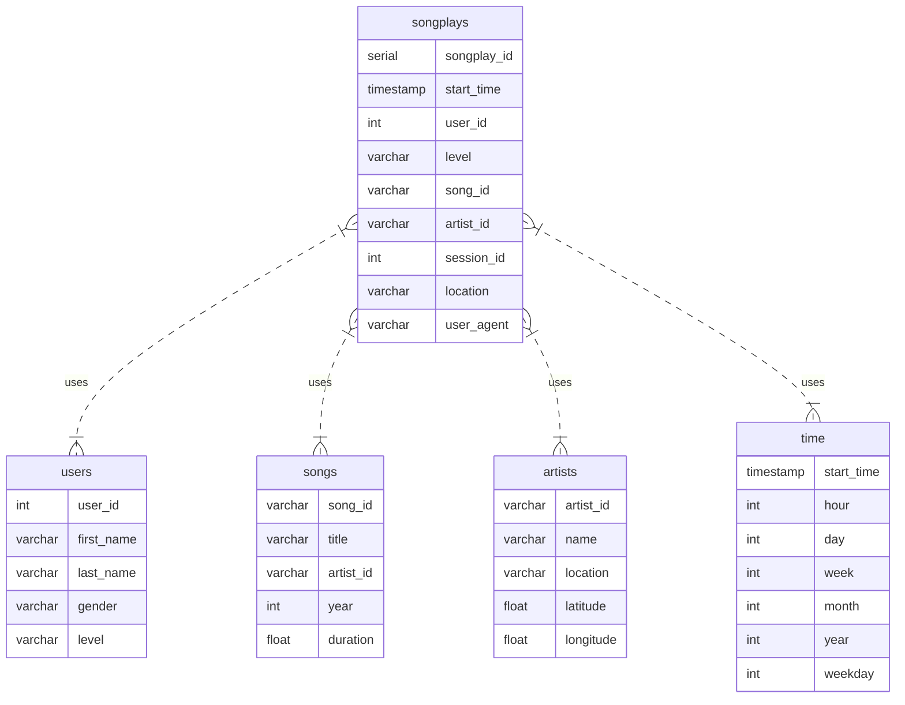

## Introduction
We create a Postgres database schema and a Python ETL (extract, transform, load) pipeline for music streaming analysis.

Our <i>`business situation`</i> looks like: 
"A startup called Sparkify wants to analyze the data they've been collecting on songs and user activity on their new music streaming app. The analytics team is particularly interested in understanding what songs users are listening to. Currently, they don't have an easy way to query their data, which resides in a directory of JSON logs on user activity on the app, as well as a directory with JSON metadata on the songs in their app."

So, our <i>`data engineering task`</i> is:

- create a Postgres database schema with fact and dimension tables to do the analysis
- implement an ETL pipeline that transfers data from files of local directories into these tables in Postgres using Python and SQL
- test the database and ETL pipeline by running queries given by the analytics team from Sparkify and compare the results with their expected ones

 

## Datasets
There are two local data directories including the relevant JSON files, called `log_data` and `song_data`.

**Song Dataset** 
The first dataset is a subset of real data from the [Million Song Dataset](http://millionsongdataset.com/). Each file is in JSON format and contains metadata about a song and the artist of that song. The files are partitioned by the first three letters of each song's track ID. 
For example, here are file paths to two files in this dataset: 
- song_data/A/B/C/TRABCEI128F424C983.json
- song_data/A/A/B/TRAABJL12903CDCF1A.json

And below is an example of what a single song file, TRAABJL12903CDCF1A.json, looks like:
- {"num_songs": 1, "artist_id": "ARJIE2Y1187B994AB7", "artist_latitude": null, "artist_longitude": null, "artist_location": "", "artist_name": "Line Renaud", "song_id": "SOUPIRU12A6D4FA1E1", "title": "Der Kleine Dompfaff", "duration": 152.92036, "year": 0}

**Log Dataset** 
The second dataset consists of log files in JSON format generated by this [event simulator](https://github.com/Interana/eventsim) based on the songs in the dataset above. These simulate activity logs from a music streaming app based on specified configurations. The log files in the dataset we are working with are partitioned by year and month. 
For example, here are filepaths to two files in this dataset: 
- log_data/2018/11/2018-11-12-events.json
- log_data/2018/11/2018-11-13-events.json

And below are examples of what the data in a log file, 2018-11-12-events.json, look like. 
![examples][image1] 

 

## Star Schema for Song Play Analysis
Using the song and log datasets, we create a star schema optimized for queries on song play analysis including the following tables:

### Fact Table
1. **songplays** - records in log data associated with song plays i.e. records with page NextSong; the associated attributes are:
- songplay_id, start_time, user_id, level, song_id, artist_id, session_id, location, user_agent 

### Dimension Tables
2. **users** - users in the app; the associated attributes are:
- user_id, first_name, last_name, gender, level
3. **songs** - songs in music database; the associated attributes are:
- song_id, title, artist_id, year, duration 
4. **artists** - artists in music database; the associated attributes are:
- artist_id, name, location, latitude, longitude 
5. **time** - timestamps of records in songplays broken down into specific units; the associated attributes are:
- start_time, hour, day, week, month, year, weekday 

 

### ER Diagram
The following diagram shows the relationship between the <i>fact songplays</i> table and the other <i>dim tables</i>.

 

## Project Instructions
**Requirements:** 
Imagine, we have the needed infrastructure available. In other words, all required Python libraries beside the standard framework as well as the connections and permissions to use the <i>sparkifydb</i> database. This is the case in the projects workspace delivered by Udacity.

So, our project steps are:
- First, clone the repository and navigate to the downloaded folder. 
- Next, run <i>`create_tables.py`</i> at least once to create the sparkifydb database with its tables, which the other files connect to. 
- Afterwards, run the script <i>`etl.py`</i> which imports the data from the datasets JSON files saving them into the Postgres database. The associated jupyter notebook contains detailed instructions of the ETL process.

During this **ETL pipeline** the <i>song_data</i> directory is examined to create the necessary <i>songs</i> and <i>artists</i> tables. Then, the <i>log_data</i> directory is used to create the <i>time</i>, <i>users</i> and <i>songplays</i> tables. The specific <i>'songplays'</i> fact table is created by joining the <i>artists</i> and <i>songs</i> tables in combination with other attributes of the <i>log_data</i> directory tables.

 

## License
This project coding is released under the [MIT](https://github.com/IloBe/postgres_data_modeling/blob/main/LICENSE) license.
